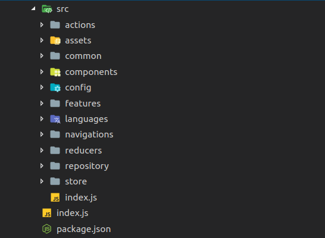
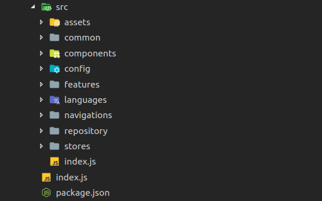
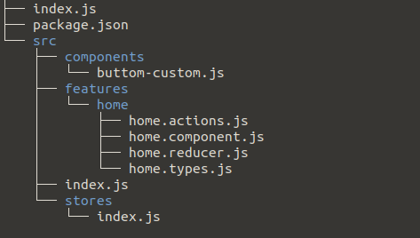

## RN-Redux CLI Tools

React Native Redux is tools help us create base project React Native, tools automatically add dependencies of Redux and add structure folder

Fast-growing create applications React Native


## Supported OperaSystem
* Window
* MacOSX
* Linux


## Make sure your computer has a nodejs installed
Install nodejs in your computer [click here](https://nodejs.org/en/)


## Install RN-Redux

```bash
npm i -g rn-redux
```

## Guide to rn-redux

Now we will use tools `rn-redux`, to create a React Native project quickly

```bash
rn-redux init AwesomeApp
rn-redux init AwesomeApp --version 0.55.3
```


### Option 1: Select a template available

Templates 1:




Templates 2:




### Option 2: Select a custom template 

1, templates in local workstation

2, templates in github

Example base project: 



package.json file has format

```json
{
  "dependencies": {
    "react-redux": "^5.0.7",
    "redux": "^4.0.0"
  },
  "devDependencies": {
    "vnrm": "0.0.11"
  }
}
```

All dependencies will install to new project

### Thanks, click on the star button above to support me

Repository React Native Redux Cli [click here](https://github.com/jundat95/rn-redux-cli)
